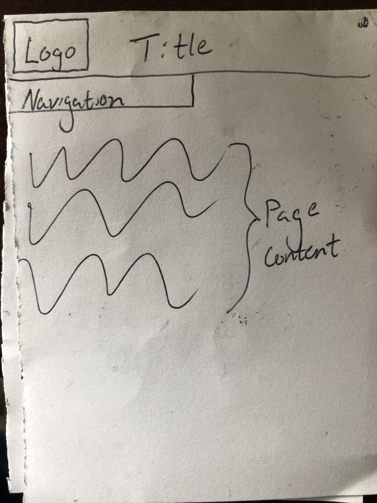

The difference between padding margin and borders is that padding is the distance from
the object to the border, the border is in the middle of the padding and the margin, and the margin is the
distance outside of the border.

I used the same work cycle I have been using. Putting a lot of time Sunday and Monday into it.
I review the material such as the website and walkthrough on Sunday, then complete
the assignment on Monday.
