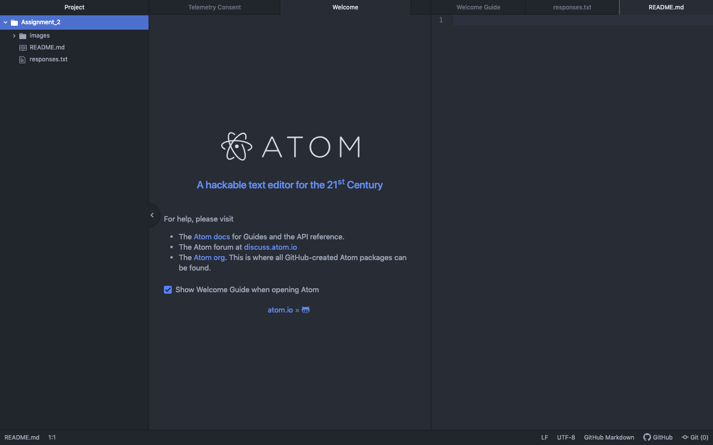

# Assignment 1
## Evan Wilken

I was registered to take the Computer Science Web Design course, but it was canceled
so I thought it would still be fun to take this course. I did a small amount of
web dev work this last summer and am excited to learn more about it!

So far I have learned about the DNS and what cookies actually are. It was also
interesting to see how data is sent over the internet, in packets.

[Fairbanks Daily News](http://www.newsminer.com/)

[Responses file](./responses.txt)

