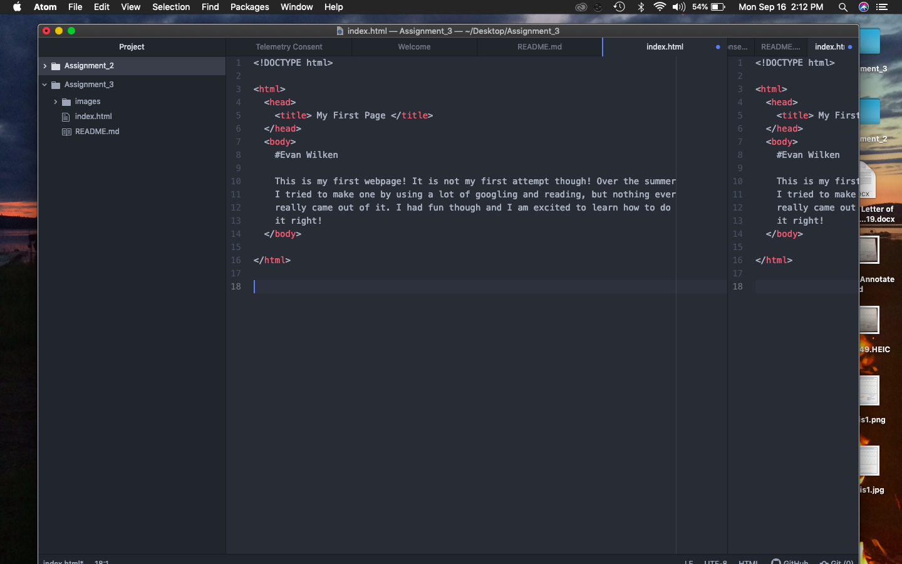

Very briefly detail how browsers function. List any browsers you currently use to surf - or even develop for - the web.
  
  Web browsers are what devices like computers or cell phones use to access the internet.
  They are software that translates languages that websites are written in into
  what we see as websites. I currently use chrome and sometimes safari to browse
  the web.

What is a markup language? Describe one commonly used in development.
  
  Markup languages are the languages that are used to write websites. They seem
  similar to programming languages. They all are used to write websites and reach
  a goal, but all specialize in different things. HTML is a common markup language.

