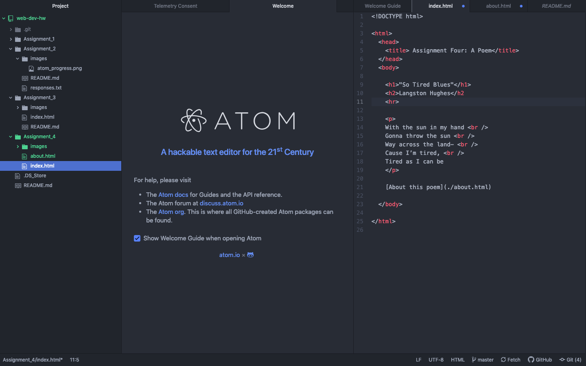

Visit a site using The Wayback Machine, looking at a snapshot at least 10 years old. Where did you go? What did it look like? How has it changed?

  I went to the Alaska.gov website from June of 2000. Wow, it looked very old and crowded, but it did have links to other Alaska resources so it would have been helpful. It even had the classic Alaskan motto in the top corner of the website, "Alaska... cool." These days the Alaska website is easily navigable, spaced out, and aesthetically pleasing. The website has come a long ways since the year 2000.

Summarize your experience with the GIT Module. What did you learn? What was difficult, easy, or still misunderstood?

  In the GIT Module I learned the similarities and differences between how to write, link, and include things in html versus markup. It is also helpful to learn that I do
  not have to drag and drop my files into GitHub Online anymore, since I had made some uploading mistakes in the past. For the most part I feel like I am understanding the material and it hasn't been too hard, but also not easy.

